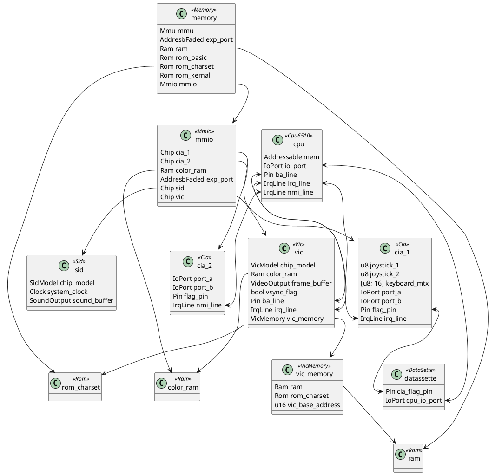

```plantuml
@startuml

class cpu << Cpu6510 >> {
  Addressable mem
  IoPort io_port
  Pin ba_line
  IrqLine irq_line
  IrqLine nmi_line
}

class cia_1 << Cia >> {
  u8 joystick_1
  u8 joystick_2
  [u8; 16] keyboard_mtx
  IoPort port_a
  IoPort port_b
  Pin flag_pin
  IrqLine irq_line
}

cpu::irq_line <--> cia_1::irq_line

class cia_2 << Cia >> {
  IoPort port_a
  IoPort port_b
  Pin flag_pin
  IrqLine nmi_line  
}

cpu::nmi_line <--> cia_2::nmi_line

class sid << Sid >> {
  SidModel chip_model
  Clock system_clock
  SoundOutput sound_buffer  
}

class vic << Vic >> {
  VicModel chip_model
  Ram color_ram
  VideoOutput frame_buffer
  bool vsync_flag
  Pin ba_line
  IrqLine irq_line  
  VicMemory vic_memory
}

cpu::irq_line <--> vic::irq_line
cpu::ba_line <--> vic::ba_line

class vic_memory << VicMemory >> {
  Ram ram
  Rom rom_charset
  u16 vic_base_address
}

vic::vic_memory --> vic_memory

class memory << Memory >> {
  Mmu mmu
  AddresbFaded exp_port
  Ram ram
  Rom rom_basic
  Rom rom_charset
  Rom rom_kernal
  Mmio mmio
}

memory::ram --> ram

class mmio << Mmio >> {
  Chip cia_1
  Chip cia_2
  Ram color_ram
  AddresbFaded exp_port
  Chip sid
  Chip vic
}

memory::mmio --> mmio
mmio::cia_1 --> cia_1
mmio::cia_2 --> cia_2
mmio::sid   --> sid
mmio::vic   --> vic

class color_ram << Ram >>

vic::color_ram --> color_ram
mmio::color_ram --> color_ram

class ram << Ram >>

vic_memory::ram --> ram

class rom_charset << Rom >>

vic::rom_charset --> rom_charset
memory::rom_charset --> rom_charset

class datassette << DataSette >> {
  Pin cia_flag_pin
  IoPort cpu_io_port
}

cia_1::flag_pin <--> datassette::cia_flag_pin
cpu::io_port <--> datassette::io_port

@enduml
```
