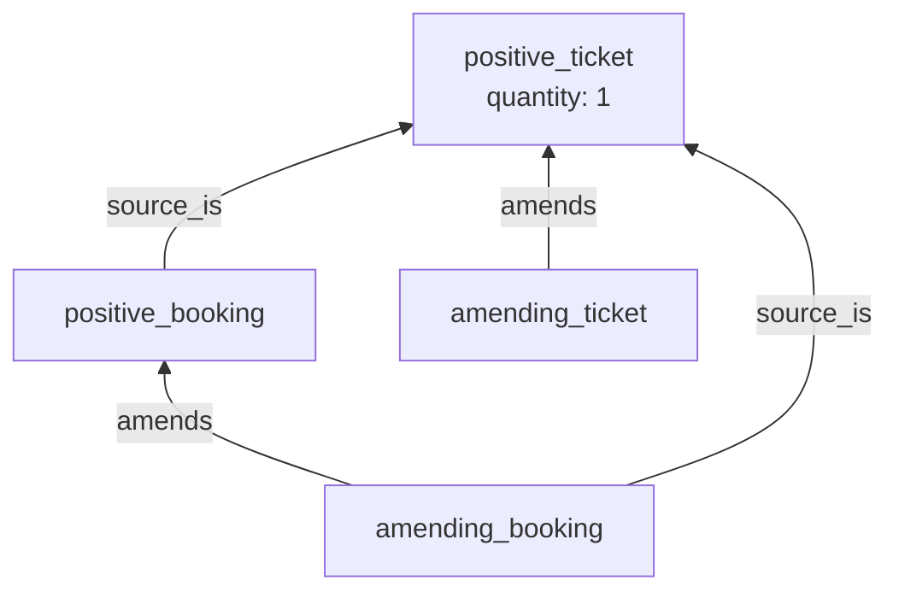
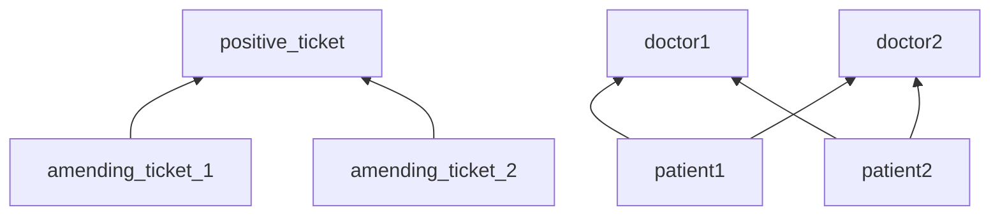
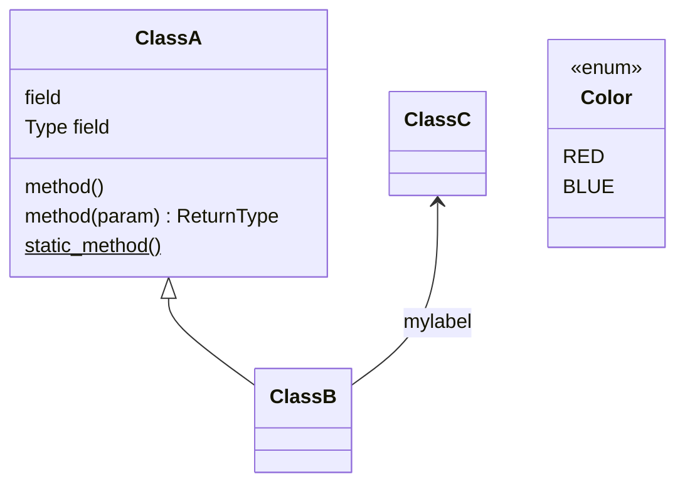
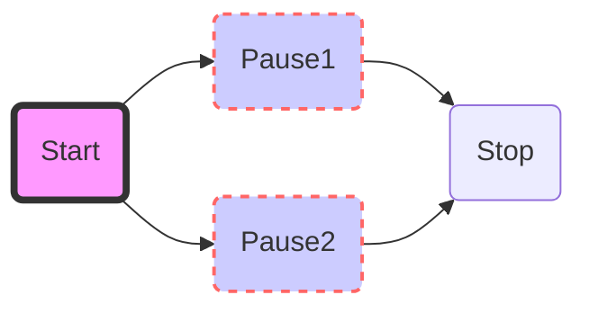

- [Table of contents](#table-of-contents)
- [Flowchart and basics](#flowchart-and-basics)
  - [Class diagrams](#class-diagrams)
- [Styling](#styling)
 
## Table of contents

- [Table of contents](#table-of-contents)
- [Flowchart and basics](#flowchart-and-basics)
  - [Class diagrams](#class-diagrams)
- [Styling](#styling)

## Flowchart and basics

The orientation is where the edges point

- `BT`, `TB`/`TD` Bottom/Down, Top
- `LR`, `RL` Left, Right

Sample format for rectangular nodes, with labeled edges: `<node_id>[<node_text>] -- <edge_text> --> <node_2_id>`. Unlabeled edge format: `-->`.

Nodes can be declared explicitly, or implicitly (in a connection).

If a node is defined multiple times with a property (ie. label), the last definition one prevails (although this is not correct).

Use ` ` for a newline, without closing tag (see #Styling for formatting/styling).

The `&` operator defines a group of nodes, which are all connected with another node (or group of).

### Class diagrams

## Styling

Styling must be defined separately.

It seems that the `style` directive can't apply to multiple nodes, so a class is used:

Edges use `linkStyle` (with a 0-based index), which can instead be applied to multiple edges, but classes can't be defined:

