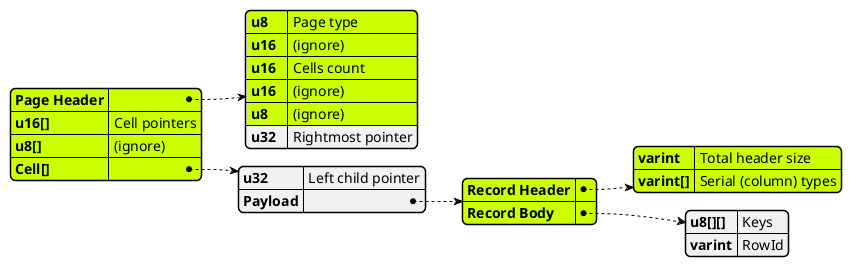
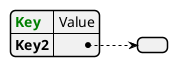
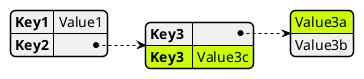

# PlantUML

- [PlantUML](#plantuml)
  - [General info](#general-info)
  - [Visual Configuration](#visual-configuration)
    - [Text Styling](#text-styling)
    - [Blocks Layout](#blocks-layout)
  - [Class diagram](#class-diagram)
    - [JSON](#json)
    - [Styling](#styling)
  - [Nesting](#nesting)
    - [JSON: Table (non-annotated) version:](#json-table-non-annotated-version)
    - [Class diagram: Class pointing to other classes](#class-diagram-class-pointing-to-other-classes)
    - [Class diagram: Package with classes inside](#class-diagram-package-with-classes-inside)
    - [Sequence diagram](#sequence-diagram)

## General info

- Online editor: https://www.planttext.com
- Object diagram: https://plantuml.com/object-diagram
- General metadata: https://plantuml.com/commons

The header (`@startuml`) and footer (`@enduml`) are optional.

Inline comments are generally not supported.

## Visual Configuration

### Text Styling

```plantuml
' list fonts; must be the only command in the doc
'
' listfonts

' set global background (behind class boxes) color
'
skinparam backgroundColor Green

' set font; the font style, e.g. monospaced, is set directly on the text, not here.
' styling does not affect edge referencing.
'
skinparam classFontName "DejaVu Sans"

' Double quotes: monospaced
' Color tag: text color
'
class MyClass {
  ""Foo foo""
  <color:green>""Foo foo""
}
```

### Blocks Layout

Aligning is not directly supported; there are [different workarounds](https://stackoverflow.com/q/11557426):

```plantuml
' The Graphviz directive works, but it's applied to the whole document
'
' left to right direction

' Via aligned edges:
'
class vic << Vic >> {
  VicMemory vic_memory
}
' For bidirectional edges, define two directed edges
vic::vic_memory -right-> vic_memory
vic::vic_memory <-left- vic_memory

' Hidden edges work if no edges are required:
'
Bob -[hidden] Alice

' Grouping is suggested, but doesn't work if there are edges across members:
'
together {
  class A
  class B
}
```

## Class diagram

Reference: https://plantuml.com/class-diagram

Nice way to create boxes with entries, and connect them (also with entries).

```plantuml
' Member types are optional
' The element in brackets, optional, displayes at the top; it's technically an interface.
'
class cpu << Cpu6510 >> {
  IrqLine irq_line
}

' Single bracketed terms are an alternative to the interface "trick"; it draws a dotted box on the
' top right; it's nice for very small annotations. It's mutually exclusive with interfaces.
class cia_1 < Cia > {
  IrqLine irq_line
}

' Bidirectional edge from member to member
cpu::irq_line <--> cia_1::irq_line

class vic << Vic >> {
  VicMemory vic_memory
}

' If an edge member->class references a non-existing class, the latter is implicitly defined.
' An edge member->member should *not* be defined before the class, though.

' Unidirectional edge from member to class.
' If there are spaces, wrape the whole node in double quotes.
vic::vic_memory --> vic_memory
```

### JSON

Reference: https://plantuml.com/json

Annotated form: probably the best for nesting; looks great (althought it relies on a hack - duplicate keys).

The alignment is inherent; non-string values are separated from the parent, connected with a dotted arrow.



### Styling

The text of a cell can be colored by tagging (prefixing) the value string, however, this doesn't allow coloring "pointer" cells (e.g. the empty cell for "Value2").



The background color of full tuples can be colored via highlight (solving the former problem), but must use a workaround (appending trailing spaces) to address duplicate keys:



## Nesting

It seems that nesting is not supported (it doesn't make sense); there are different approaches.

### JSON: Table (non-annotated) version:

```plantuml
' Spaces are not supported in the header.
' Interfaces are supported but not single brackets.
'
json InteriorIndexPage << No overflow >> {
   "PageHeader": {
     "u8":   "Page type",
     "u16":  "(ignore)",
     "u16":  "Cells count",
     "u16":  "(ignore)",
     "u8":   "(ignore)",
     "u32":  "Rightmost pointer"
   },
   "u16[]":      "Cell pointers",
   "u8[]":       "(ignore)",
   "Cell[]":     {
     "u32":               "Left child pointer",
     "Payload": {
       "Record Header": {
         "varint":   "Total header size",
         "varint[]": "Serial (column) types"
       },
       "Record Body": {
         "u8[][]": "Keys",
         "varint":  "RowId"
       }
     }
   }
}
```

### Class diagram: Class pointing to other classes

https://www.sqlite.org/fileformat.html

Works nicely, but it's not clear: how to align the classes and the text (/use a monospace font). Partial example:

```plantuml
package "Index Interior" {
  class Page {
    PageHeader header
    u16[]      cell_pointers
    u8[]       free_space
    Cell[]     cells
  }

  class PageHeader {
    u8   page_type
    u16  _
    u16  cells_count
    u16  _
    u8   _
    u32  rightmost_pointer
  }

  class Cell {
    u64     left_child_pointer
    Payload payload
  }

  Page::header  --> PageHeader
  Page::cells   --> Cell
}
```

### Class diagram: Package with classes inside

Packages with classes inside won't work, as the classes align horizontally; also, pointing classes is just better.

```plantuml
package "Index interior" {
  class Header {
    type
    num_cells
    ...
    right_m_ptr
  }
  class CellPointers {
    pointer1
    ...
    pointerN
  }
}
```

### Sequence diagram

Just for curiosity; doesn't work with class diagram elements.

```plantuml
' required engine
!pragma teoz true

box "component"
  ' sub-boxes are laid out horizontally

  ' Use \n to add spacing below (inside the box)
  box "sub1\n\n"
    participant a

    box "subsub1"
      participant suba
    end box
  endbox

  box "sub2"
    participant b
  endbox
end box
```