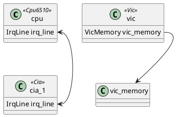

# PlantUML

- [PlantUML](#plantuml)
  - [Class diagram](#class-diagram)

## Class diagram

```plantuml
' header; optional in the VSC Markdown extension, but suggested (along with footer).
@startuml

' Member types are optional
class cpu << Cpu6510 >> {
  IrqLine irq_line
}

class cia_1 << Cia >> {
  IrqLine irq_line
}

' Bidirectional edge from member to member
cpu::irq_line <--> cia_1::irq_line

class vic << Vic >> {
  VicMemory vic_memory
}

' If an edge member->class references a non-existing class, the latter is implicitly defined.
' An edge member->member should *not* be defined before the class, though.

' Unidirectional edge from member to class
vic::vic_memory --> vic_memory

@enduml
```
