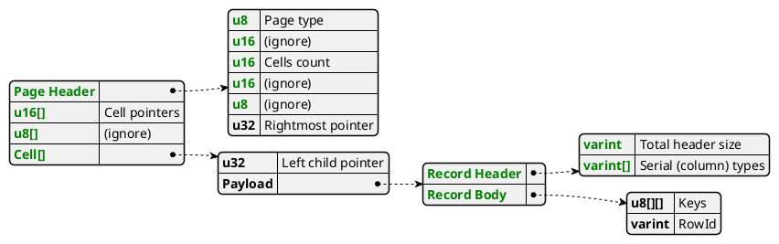

# PlantUML

- [PlantUML](#plantuml)
  - [General info](#general-info)
  - [Class diagram](#class-diagram)
    - [JSON (also best for tables/nesting)](#json-also-best-for-tablesnesting)
  - [Nesting](#nesting)
    - [Class diagram: Class pointing to other classes](#class-diagram-class-pointing-to-other-classes)
    - [Class diagram: Package with classes inside](#class-diagram-package-with-classes-inside)
    - [Sequence diagram](#sequence-diagram)

## General info

- Online editor: https://www.planttext.com
- Class diagram: https://plantuml.com/class-diagram
- Object diagram: https://plantuml.com/object-diagram
- General metadata: https://plantuml.com/commons

The header (`@startuml`) and footer (`@enduml`) are optional.

## Class diagram

Nice way to create boxes with entries, and connect them (also with entries).

```plantuml
' Member types are optional
' The element in brackets, optional, displayes at the top; it's technically an interface.
'
class cpu << Cpu6510 >> {
  IrqLine irq_line
}

' Single bracketed terms are an alternative to the interface "trick"; it draws a dotted box on the
' top right; it's nice for very small annotations. It's mutually exclusive with interfaces.
class cia_1 < Cia > {
  IrqLine irq_line
}

' Bidirectional edge from member to member
cpu::irq_line <--> cia_1::irq_line

class vic << Vic >> {
  VicMemory vic_memory
}

' If an edge member->class references a non-existing class, the latter is implicitly defined.
' An edge member->member should *not* be defined before the class, though.

' Unidirectional edge from member to class.
' If there are spaces, wrape the whole node in double quotes.
vic::vic_memory --> vic_memory
```

### JSON (also best for tables/nesting)

Reference: https://plantuml.com/json

Annotated form: probably the best of all; looks great!

The alignment is inherent; non-string values are separated from the parent, connected with a dotted arrow:



Table (non-annotated) version:

```plantuml
' Spaces are not supported in the header.
' Interfaces are supported but not single brackets.
json InteriorIndexPage << No overflow >> {
   "PageHeader": {
     "u8":   "Page type",
     "u16":  "(ignore)",
     "u16":  "Cells count",
     "u16":  "(ignore)",
     "u8":   "(ignore)",
     "u32":  "Rightmost pointer"
   },
   "u16[]":      "Cell pointers",
   "u8[]":       "(ignore)",
   "Cell[]":     {
     "u32":               "Left child pointer",
     "Payload": {
       "Record Header": {
         "varint":   "Total header size",
         "varint[]": "Serial (column) types"
       },
       "Record Body": {
         "u8[][]": "Keys",
         "varint":  "RowId"
       }
     }
   }
}
```

## Nesting

It seems that nesting is not supported (it doesn't make sense); there are different approaches.

### Class diagram: Class pointing to other classes

https://www.sqlite.org/fileformat.html

Works nicely, but it's not clear: how to align the classes and the text (/use a monospace font). Partial example:

```plantuml
package "Index Interior" {
  class Page {
    PageHeader header
    u16[]      cell_pointers
    u8[]       free_space
    Cell[]     cells
  }

  class PageHeader {
    u8   page_type
    u16  _
    u16  cells_count
    u16  _
    u8   _
    u32  rightmost_pointer
  }

  class Cell {
    u64     left_child_pointer
    Payload payload
  }

  Page::header  --> PageHeader
  Page::cells   --> Cell
}
```

### Class diagram: Package with classes inside

Packages with classes inside won't work, as the classes align horizontally; also, pointing classes is just better.

```plantuml
package "Index interior" {
  class Header {
    type
    num_cells
    ...
    right_m_ptr
  }
  class CellPointers {
    pointer1
    ...
    pointerN
  }
}
```

### Sequence diagram

Just for curiosity; doesn't work with class diagram elements.

```plantuml
' required engine
!pragma teoz true

box "component"
  ' sub-boxes are laid out horizontally

  ' Use \n to add spacing below (inside the box)
  box "sub1\n\n"
    participant a

    box "subsub1"
      participant suba
    end box
  endbox

  box "sub2"
    participant b
  endbox
end box
```